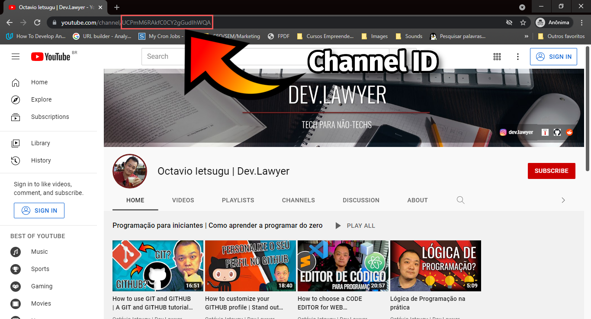
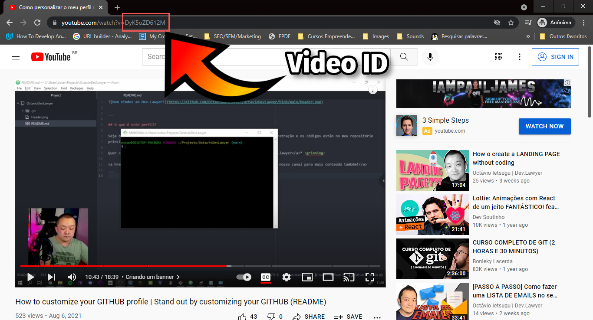
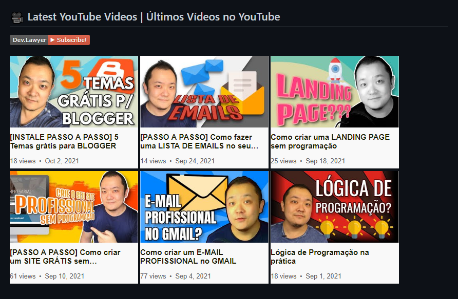

# 🎥 YouTube Thumbnail Retriever
With this solution you will be able to do this:
<center>


</center>

If you want to display a YouTube Video Thumbnail in your README file (or, for that matter, wherever you need it), you can simply use as a source the following:

```

```
or, in Markdown
```

```

Where, as you can imagine, YOUTUBE_CHANNEL_ID must be your YouTube Channel ID and YOUTUBE_VIDEO_ID will be your Video ID. If you don't know where to find the Channel and Video ID, they can be found here:
<br /><br />
**Channel ID**

<br /><br />
**Video ID**

<br /><br />

---

<br />

## 💡 Automatically display a list of recent YouTube Videos



If you want to display a list of your recent YouTube Videos in a README file (such as your special profile repo), you can use this solution to easily display thumbnails in a layout that resembles YouTube listings, jointly with [Gautam krishna R](https://github.com/gautamkrishnar)'s [Blog post workflow](https://github.com/gautamkrishnar/blog-post-workflow) repo:

- In your repository, create a folder named **.github** and create a **workflows** folder inside it, if it doesn't exist.
- Inside this **.github/workflows** folder, create a **youtube-workflow.yml** file, with this content:

```
name: Template Latest Youtube
on:
  schedule:
    # Runs at 08h00 on Sunday: set here your schedulled automation. If you are not familiar with cron, use https://crontab.guru/
    - cron: '0 8 * * 0'
  workflow_dispatch:
jobs:
  update-readme-with-youtube-activity:
    name: Update this repo's README with latest activity from YouTube
    runs-on: ubuntu-latest
    steps:
      - uses: actions/checkout@v2
      - uses: gautamkrishnar/blog-post-workflow@master
        with:
          comment_tag_name: "YOUTUBE" # the tag you will use in your README.md file
          commit_message: "Updated readme with the latest youtube data"
          feed_list: "https://www.youtube.com/feeds/videos.xml?channel_id=your_channel_Id" #replace with your channel Id 
          custom_tags: "channelId/yt:channelId/,videoId/yt:videoId/"
          max_post_count: 6
          template: '$newline[]($url)'
```
- In your README.md file, insert the following where you want your YouTube list to appear:
```
<!-- YOUTUBE:START -->
<!-- YOUTUBE:END -->
```

3. Commit the changes above and run your GitHub Action on GitHub. 
<br /><br />
## Support

For support and Bugs, don’t forget to open a new [issue](https://github.com/Dev-Lawyer/youtube-thumbnail-retriever/issues/new).
<br /><br />  
## Thanks to

 - [Vercel](https://vercel.com/) for its great Free Tier hosting service for this app; and
 - [Gautam krishna R](https://github.com/gautamkrishnar) for his awesome [Blog post workflow](https://github.com/gautamkrishnar/blog-post-workflow) repo.
<br /><br /> 
## Author | Connect with me
Hey, if you like it, don't forget to star this repo 😉 If you want to connect with me, please reach me out at any of the following:

GitHub (personal): https://github.com/OctavioSI<br/>
GitHub (channel): https://github.com/Dev-Lawyer<br/>
YouTube: https://www.youtube.com/channel/UCPmM6RAkfC0CY2gGudIhWQA<br/>
Instagram: https://www.instagram.com/dev.lawyer/<br/>
Blog: https://dev.lawyer/<br/>
Facebook: https://www.facebook.com/br.dev.lawyer<br/>
LinkedIn: https://www.linkedin.com/in/octaviosi/<br/>
E-mail: [octavio@dev.lawyer](mailto:octavio@dev.lawyer)
<br /><br />  
## Want to host your own app?

If you'd rather deploy your own version of this app so as to not rely on mine, please feel free to do so. Just click on the button below:

[](https://vercel.com/new/clone?repository-url=https%3A%2F%2Fgithub.com%2FDev-Lawyer%2Fyoutube-thumbnail-retriever)
<br /><br />
## License

[MIT](https://choosealicense.com/licenses/mit/)